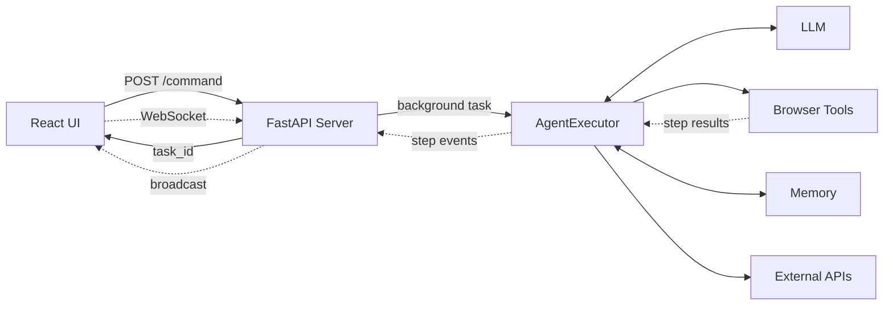

# AI Browser Agent — System Architecture

*Assignment 6 · Architecture Document*

## Overview

The system lets a person type a natural-language command, watch an AI agent carry it out in a real browser, and see every step as it happens. Five layers each do one job: the **UI** collects the command and displays live progress, **FastAPI** brokers requests and holds them stable across the network, the **AgentExecutor** (LangGraph ReAct agent) decides what to do next at each step, **Browser Tools** (Playwright) are the hands that actually click and type, and **Memory** (SQLite today, ChromaDB later) is what lets the agent know who it's acting for.

## Diagram

## Component responsibilities

| Layer | Responsibility | Built in |
|---|---|---|
| **React UI** | Collect the command, render live steps, edit the stored profile | Week 6 |
| **FastAPI** | Accept commands, run the agent as a background task, persist task state, stream updates over WebSocket | Week 5 |
| **AgentExecutor** | Reason → Act → Observe loop; decides which tool to call next based on the command and prior results | Week 4 |
| **LLM** | Supplies the reasoning at each agent step; also powers the standalone intent parser | Week 3 |
| **Browser Tools** | Execute the concrete action the agent decided on (`navigate_to`, `click_element`, `type_text`, `get_page_title`) | Week 2 |
| **Memory** | Store the user's profile (name, email, resume) so the agent can answer "what's my email?" without asking; store task history for `/status` | Week 5 |
| **External APIs** | Send emails, create calendar events, read uploaded resumes — extends what the agent can *do*, not just where it can click | Week 5B / Week 9 |

## Data flow — one command, end to end

1. Person types a command into the UI and hits **Run**.
2. UI sends `POST /command`; FastAPI generates a `task_id`, writes a `queued` row to SQLite, and returns immediately.
3. UI opens `WS /ws/{task_id}`.
4. FastAPI starts the agent as a background task. The agent's LangGraph loop begins: it asks the LLM what to do, the LLM either replies with an answer or picks a tool.
5. Each tool call runs against the real Playwright browser tab; the result (success or `❌`) goes back to the LLM as the next observation.
6. After every step, FastAPI writes it to SQLite and broadcasts it over the WebSocket — the UI's activity log grows in real time.
7. The loop repeats until the LLM produces a final answer instead of a tool call. FastAPI marks the task `completed` (or `failed` if something threw), and the UI shows the final result.

## Key design decisions

- **Background tasks, not synchronous requests** — browser automation can take 10+ seconds; the UI needs a `task_id` back immediately, not a hanging HTTP connection.
- **WebSocket for push, REST for pull** — `/status/{task_id}` always works (e.g. after a page refresh); the WebSocket is purely an optimization for real-time updates, with a `history` replay on connect so late subscribers aren't lost.
- **SQLite now, ChromaDB later** — today's memory is exact-match (profile fields, task-by-id). The Week 6-stretch/Week 9 upgrade adds semantic memory — "what did I ask it to do last time about this site?" — without changing the contract the UI depends on.
- **One agent process per browser tab** — Playwright's sync API ties a browser page to the thread that created it, so the agent runs in a dedicated worker process with a single pinned thread, avoiding cross-thread browser access entirely.
